# Comments++

This plugin is a successor to [Comments], that adds comment functionality inspired on Google Docs.

## How it works
A new callout is defined
```md
> [!COMMENT++] AUTHOR | DATE | UNIQUE_ID
> COMMENT
```

If you click the ribbon to open the plugin, the Comments View will open and show all comments within the file. This will show the name, date, and content of the comment (specified like in the callout above).

## Legacy Features
- Command to quickly add a comment (`Ctrl + P` -> `Comments++: Add new comment`).

- Quickly add sub-comments with right click in the Comments View.
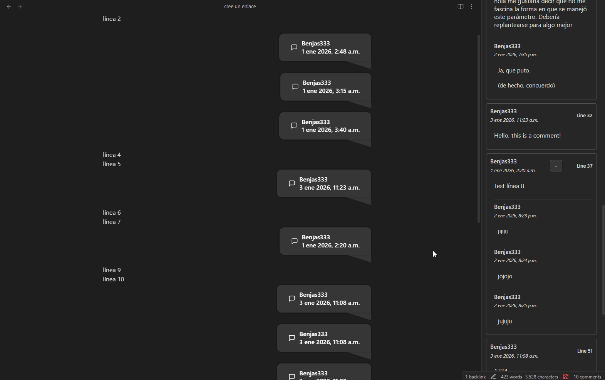
- Quickly remove comments with right click in the Comments View.
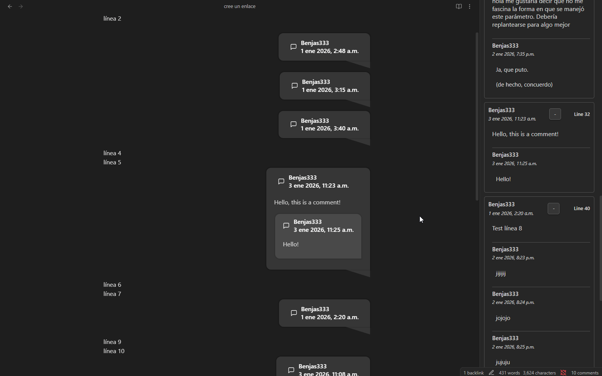
- Quickly navigate to the place of the comment with left click in the Comments View.
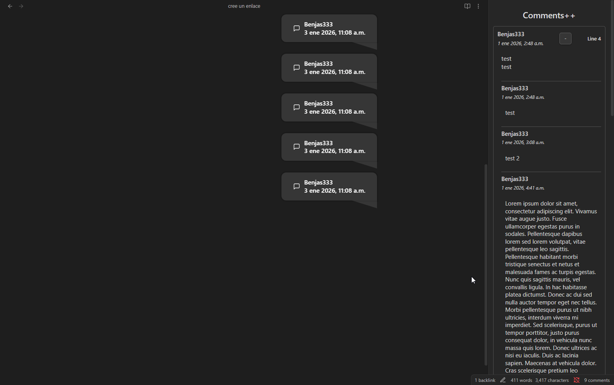
- Comments are hidden in reading mode and when exporting it to other documents (e.g. PDF).
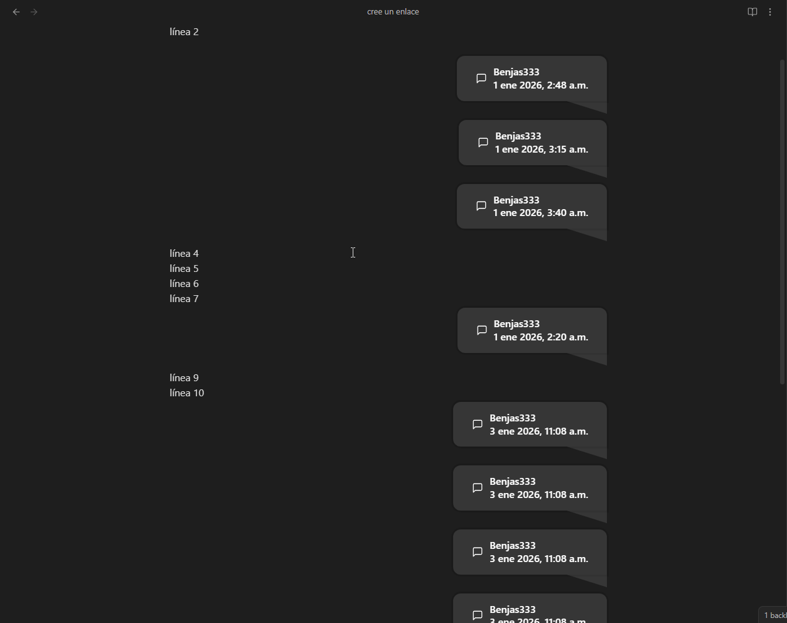

## New Features
- Improved css and datetime format.

  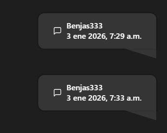
- Added modals to request the content of new comments.
- Command can add sub-comments too.
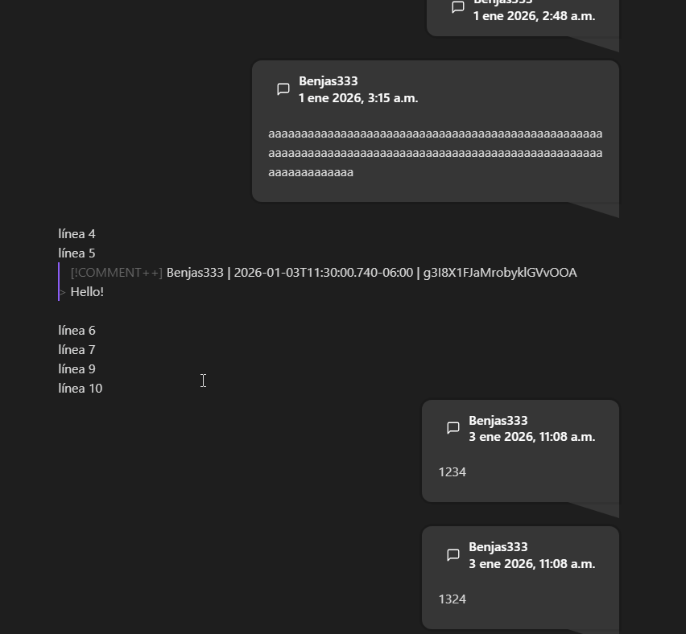
- Button to quickly add a comment in the editor context menu.
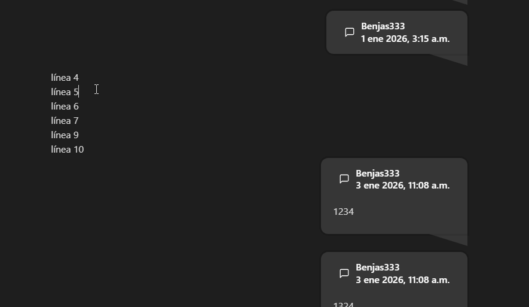
- Quickly add sub-comments with right click in the Editor.
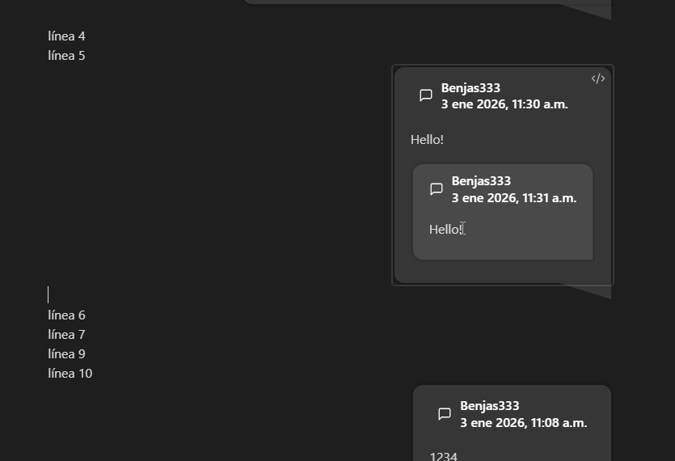
- Quickly remove comments with right click in the Editor.
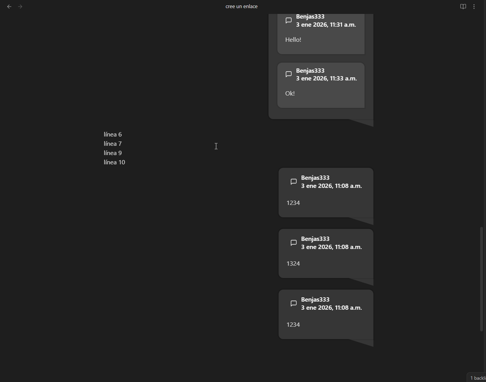
- Status bar with comments count per file and click to open the Comments View.

- Settings:
  - Default name.
  - [Relay] integration:
    - Use [Relay] login name.
  - Expanded and collapsed mode for view.
  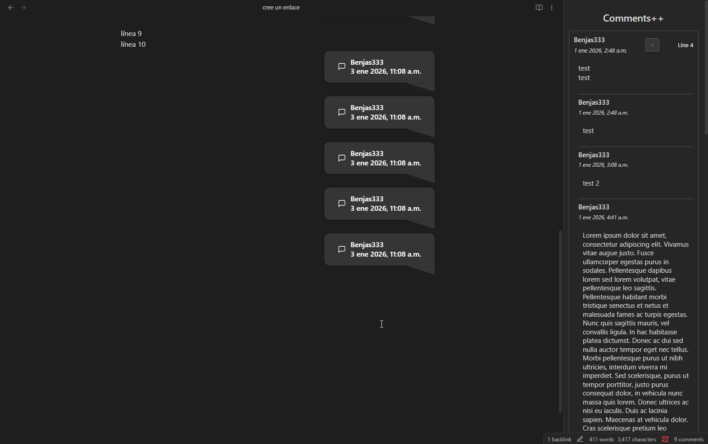
  - Expanded and collapsed mode for editor.
  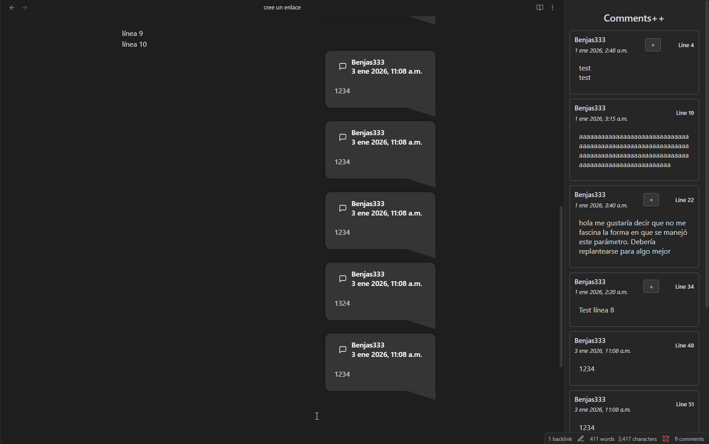
  - Comments alignment in the editor.
  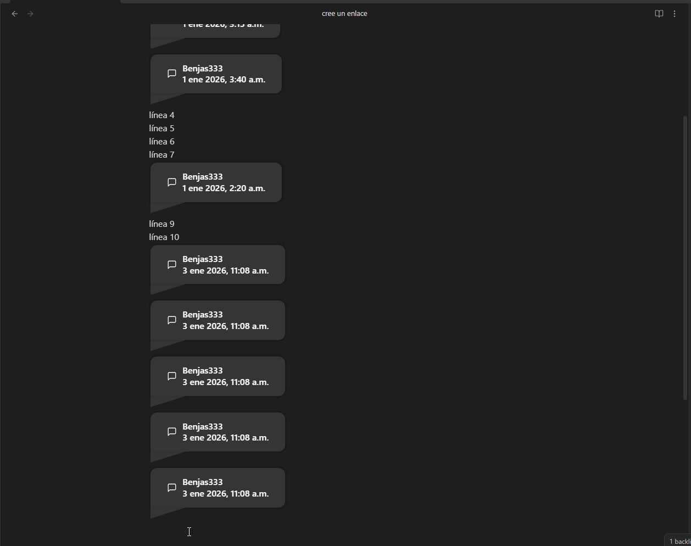

## TODO
- Add @person feature and highlighting.
- Add comment colors for every person (Relay integration).
- Improve code in general.
- Clean the CSS (there're unused classes from the legacy plugin).
- Add configurable datetime format in settings.
- Add indexing for comments in all the vault instead of per file (in the View and maybe in the status bar).

<!-- This sample plugin demonstrates some of the basic functionality the plugin API can do.
- Adds a ribbon icon, which shows a Notice when clicked.
- Adds a command "Open modal (simple)" which opens a Modal.
- Adds a plugin setting tab to the settings page.
- Registers a global click event and output 'click' to the console.
- Registers a global interval which logs 'setInterval' to the console. -->

<!-- ## Releasing new releases

- Update your `manifest.json` with your new version number, such as `1.0.1`, and the minimum Obsidian version required for your latest release.
- Update your `versions.json` file with `"new-plugin-version": "minimum-obsidian-version"` so older versions of Obsidian can download an older version of your plugin that's compatible.
- Create new GitHub release using your new version number as the "Tag version". Use the exact version number, don't include a prefix `v`. See here for an example: https://github.com/obsidianmd/obsidian-sample-plugin/releases
- Upload the files `manifest.json`, `main.js`, `styles.css` as binary attachments. Note: The manifest.json file must be in two places, first the root path of your repository and also in the release.
- Publish the release.

> You can simplify the version bump process by running `npm version patch`, `npm version minor` or `npm version major` after updating `minAppVersion` manually in `manifest.json`.
> The command will bump version in `manifest.json` and `package.json`, and add the entry for the new version to `versions.json` -->

<!-- ## Adding your plugin to the community plugin list

- Check the [plugin guidelines](https://docs.obsidian.md/Plugins/Releasing/Plugin+guidelines).
- Publish an initial version.
- Make sure you have a `README.md` file in the root of your repo.
- Make a pull request at https://github.com/obsidianmd/obsidian-releases to add your plugin. -->

[Comments]: https://github.com/JasperSurmont/obsidian-comments
[Relay]: https://github.com/No-Instructions/Relay
